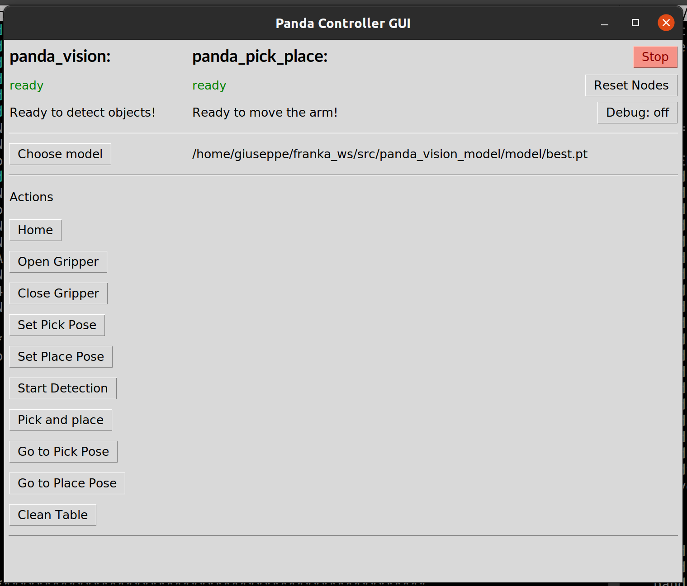
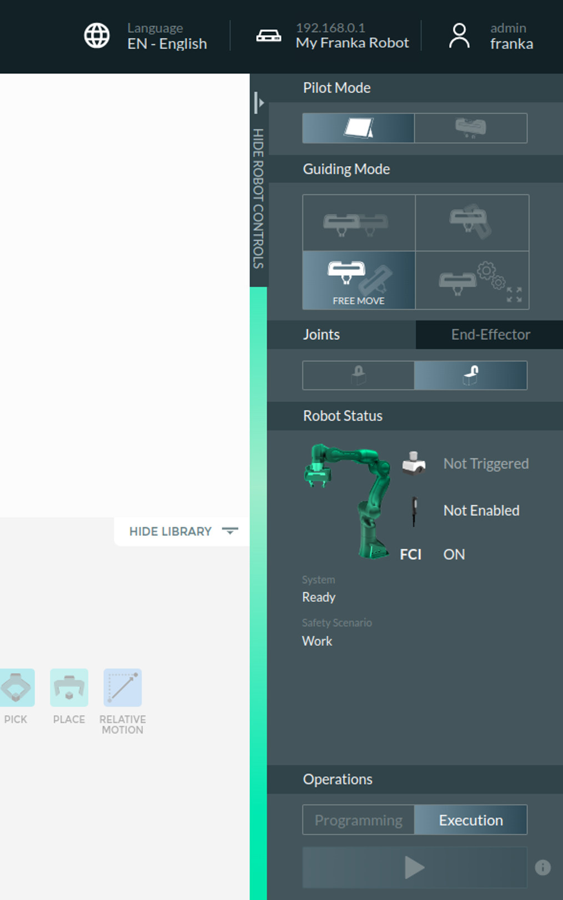
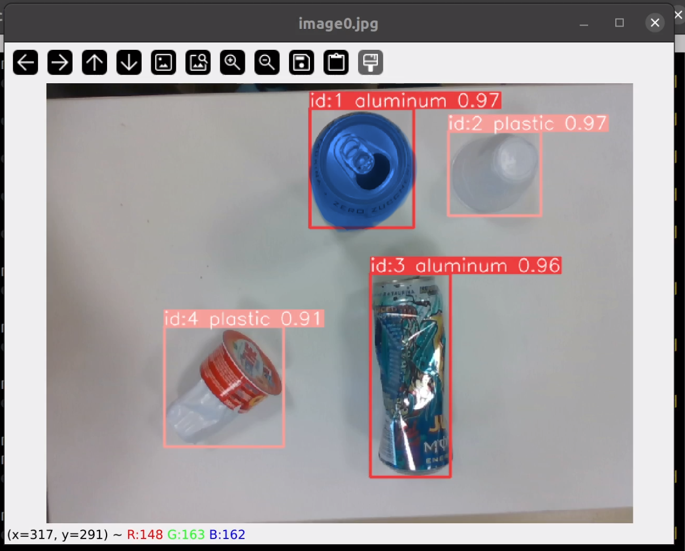

# Introduction

<!-- TODO: Mettici la gif della demo-->

This project is part of the thesis work for the bachelor's degree program in Electronic and Telecommunications Engineering, Automation track, at the University of Florence.
The goal is to set up the Panda robot from Franka Emika for pick and place operation. The idea is to realize a project as modular and open to update as possible.
The project is splitted in two main parts:
1. Robot control
2. Object detection
### 1. Robot control
Learn to control the robot and carry out simple operation like pick and place. 
### 2. Object detection
Learn to create a neural network that can detect simple object that should be picked and placed.

Finally combine the two functionality to solve the initial problem
# Requirements
The robot model is [Panda from Franka Emika](https://frankaemika.github.io/docs/overview.html). The camera model is [Intel RealSense d435i](https://dev.intelrealsense.com/docs/sdk-knowledge-base).
This project is developed with [ROS Noetic](http://wiki.ros.org/noetic/Installation/Ubuntu) on Ubuntu 20.04. It depends on the following packages:
- [franka_ros](https://frankaemika.github.io/docs/franka_ros.html)
- [panda_moveit_config](https://github.com/lazyengi/panda_moveit_config)
- [realsense-ros](https://github.com/IntelRealSense/realsense-ros/tree/ros1-legacy)
- [panda_vision_model](https://github.com/lazyengi/panda_vision_model)
- [panda_pick_place_msgs](https://github.com/lazyengi/panda_pick_place_msgs)

# Installation
You should already have ROS Noetic installed. Also, follow the getting started guides for franka_ros and realsense-ros.

You should have MoveIt 1 installed; otherwise, follow the [getting start guide](https://moveit.github.io/moveit_tutorials/doc/getting_started/getting_started.html). If you want to use my MoveIt configuration, clone the repository of my `panda_moveit_config`.

Follow the instructions on the GitHub page of realsense-ros to install the camera nodes.

Clone or download `panda_pick_place`, `panda_vision_model`, and `panda_pick_place_msgs` into \<your catkin workspace\>/src/ folder and build them.

If you want to train your own model for computer vision, my tip is to install YOLO by following this [guide](https://docs.ultralytics.com/it/quickstart/#conda-docker-image).

# Project stucture
By launching the panda_pick_place.launch file, you will run three nodes:

1. The vision node (`panda_vision`)
2. The robot controller node (`panda_pick_place`)
3. The control hub (`panda_controller`)

The computer vision node provides the topics that serve the vision scope. It reads the image from the Intel RealSense node and processes the image data to determine the object's spatial position.

All the topics about the robot control are from the `panda_pick_place` node.

Finally the control hub provides a guid to easily interact with the robot and also synchronize the other nodes. 

# Available Configurations
Under the `config` folder, there is the `pick_place.yaml` file. In this file you can customize:

- **handshaking_freq**: the frequency of the handshaking between controller, pick and place node and vision node;
- **default_pick_pose**: you can choose a default pick pose that you can then change at runtime by the action provided in the control hub. You can choose only one pick pose. All the poses of this file are in the joint space, thus an array of 7;
- **default_place_poses**:You can set a list of place poses whose index should correspond to the index of the class of the object detection. You can change these too from the control hub.
- **place_poses_count**: the length of the `default_place_poses` list;
- **default_velocity_scaling_factor**: the velocity scaling factor of the arm. It's recommended not to go over 0.7;
- **default_acceleration_scaling_factor**: the acceleration scaling factor of the arm. It's recommended not to go over 0.7;
- **gripper_closed_epsilon**: when the gripper closes around a thin object each finger has its position and the sum of the two positions is the width of the object grasped. So this parameter (in meters) indicates that under `<gripper_closed_epsilon>` meters, the gripper is considered closed without grasping an object. It can happen that when the gripper is closed, the width between fingers still results in around 0.0005 meters;
- **rotation_step**: when the arm chooses which object to grasp, it should know the position in space but also the orientation. From the object detection, you have only a box around the object with sides parallel to the image frame. With the fingers of the gripper configured to grasp small objects, you can grasp objects only 8 centimeters wide. So to choose the best angle, the arm makes multiple detections, maximizing or minimizing the width of the bounding box. After each detection, the hand of the arm rotates by `<rotation_step>`;
- **model/path**: the path of the object detection model. You can change it at runtime from the control hub;
- **vision/depth_epsilon**: the Intel RealSense d435i camera has an infrared depth camera. So you can have some configurations of the objects on the table that create some holes in the point cloud. When the model carries out the detection, it takes the center of the bounding box with the highest confidence. To avoid failing the detection right away, it tries to find a depth point around the center of the bounding box. If the point cloud has a hole, the depth is at 0 meters. You can continue searching for a valid depth point until some depth over the `<depth_epsilon>`;


- **vision/depth_step**: the count of pixel to move from the previous point;
- **tf/rate_freq**: the frequency of the broadcast of the transform matrix from the `panda_hand` to the `camera_link` frame by the `tf2` broadcaster;
- **tf/panda_ee_link**: the name of the end effector link frame of the robot;
- **tf/camera_link**: the name of the camera frame;
- **tf/tf_matrix**: the homogeneous transform matrix from the `<panda_ee_link>` to the `<camera_link>`;
- **gui/width**: the width of the GUI window;
- **gui/heigth**: the heigth of the GUI window;
- **guid/columns_count**: the count of the columns of the GUI.

# Run the project

You have to run the robot interface node from the `panda_moveit_config` package by executing:

```
roslaunch panda_moveit_config franka_control.launch robot_ip:=<robot_ip> load_gripper:=true robot:=panda
```

Make sure to insert your robot's IP address.

Then, you need to run the camera node with the color camera aligned to the depth camera:

```
roslaunch realsense2_camera rs_camera.launch align_depth:=true
```

Now, you can start the project by running:

```
roslaunch panda_pick_place panda_pick_place.launch
```




# Control hub

Listed in the first row are the nodes we need to control. Under the name of each node, you have the status of the node. You can start the control when both nodes are ready. At the end of the row, there is a stop button that sends the shutdown message to all the nodes. If you need to restart the nodes (e.g., if the `franka_control` node has an issue), you can tap on the *Reset Nodes* button. If you want to go step by step during the pick and place process (e.g., stop after the detection and ask for the command to proceed with the pick), turn the debug mode on.

Then, you have the row where you can change the model you want to use for object detection.

Finally, there are all the possible actions. Here are the details:
- *Home*: homing of the arm;
- *Open Gripper*: self-explanatory;
- *Close Gripper*: self-explanatory;
- *Set Pick Pose*: before tapping on this button, move the arm to the pick position you want to set.

Here's how you can do it:

1. Without shutting down any nodes, go to the browser where you have the Franka interface and set the *Programming operation*.



2. By lightly clicking both buttons on the gripper, you can move the arm to the desired pose.

3. Back on the Franka interface, switch to *Execution operation*.

4. Now tap on the *Set pick pose* button on the control hub. If an error is thrown, tap *Reset nodes* and try again with the *Set pick pose* button.

Back to the actions on the hub:

- *Set Place Pose*: you can set as many poses as specified in the config file;
- *Start Detection*: perform a single detection;
- *Pick and Place*: perform a single pick and place operation;
- *Go to Pick Pose*: move the arm to the pick pose;
- *Go to Place Pose*: move the arm to the place pose;
- *Clean Table*: start the routine of picking and placing objects until there is nothing left to grasp.

# Roadmap
I will explain some of the problems that can be evaluated.

1. The debug is not working properly. When reaching a breakpoint, the operator node should print a message on the debug topic (i.e., `/panda_pick_place/debug`) and wait for the go message. There is some bug, or maybe the algorithm needs to be rethought.

2. At the start of the pick pose routine, the arm is in the pick pose where it makes the first detection. When it chooses an object to grasp, it lowers a bit over it and starts the process to optimize the picking angle. If there are close objects with high detectability, the computer vision can detect another object different from the first choice. Is there a better way to do it?

3. During my research, the arm controller plans the trajectory from one pose to another by optimizing some parameters. Thus, it can happen that it chooses a long and dangerous trajectory that can also lead to reaching joint velocity limits. Can you plan the trajectory using some waypoints or place virtual obstacles to force the trajectory?

4. In the image below, you can see that the top of the blue-highlighted can is detected not with a square bounding box but as a rectangle. This leads the gripper to position itself not in the center of the top circle but maybe a little bit lower (imagine it’s trying to grasp the object vertically). Since the can is almost as large as the gripper width, it can cause trouble. Thus, object distortion leads to arm collision with hard objects. So, some distortion compensation is necessary.



# My project
I chose to train the object detection model to recognize plastic bottles, cups, and cans. The goal of this experiment was to throw some mixed objects of these two classes on a table and then put each object in the correct box.

I leave you with the routine that closes the project.

#

Special thanks go to Professor Benedetto Allotta for giving me the opportunity to work with the arm, Mirco Vangi for patiently listening and giving me a big hand every day in the lab, Nicola Secciani for the valuable advice, and the entire Unifi Robotics team.

*Giuseppe A. Dimola, University of Florence.*